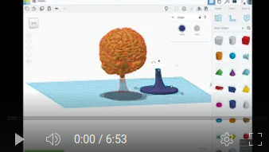

# 3D print your brain using Docker

A Docker image to create readily 3D-printable brains from T1 MRI scans. Just build the Docker image and run a command with your NIFTI file get a readily reconstructed STL mesh for 3D printing. This is an updated & extended version of [miykael/3dprintyourbrain](https://github.com/miykael/3dprintyourbrain).

The actual process is as simple as running these two commands

```bash
docker build --tag 3dprintedbrain .
docker run -it -v ./:/opt/share 3dprintedbrain subject.nii
```

**Prerequisites**:

- [Docker](https://www.docker.com/products/docker-desktop/) client installed
- Freesurfer license (it's [free](https://surfer.nmr.mgh.harvard.edu/registration.html))
- [T1 MRI](https://en.wikipedia.org/wiki/Magnetic_resonance_imaging_of_the_brain) of your brain in NIFTI format (.nii or .nii.gz)
   - you can convert DICOM files easily to NIFTI using [dcm2niigui](https://github.com/skjerns/3dprintedbrain_docker/tree/master/dcm2nii) or [dcm2niix](https://github.com/rordenlab/dcm2niix)

# Instructions

## 1\. Install Docker

Follow the instructions here to install Docker for your system (if not already installed). It is available for all major operating system.

* [Install Docker Desktop on Mac ](https://docs.docker.com/desktop/install/mac-install/)
* [Install Docker Desktop on Windows](https://docs.docker.com/desktop/install/windows-install/)
* [Install Docker Desktop on Linux](https://docs.docker.com/desktop/install/linux-install/)

## 2\. Clone the repository and build docker image

Clone this repository by running

`git clone git@github.com:skjerns/3dprintedbrain_docker.git`

Then put your freesurfer license in the cloned repository. You can get the `license.txt` for free at [FreeSurfer Registration form](https://surfer.nmr.mgh.harvard.edu/registration.html).

Navigate into the newly cloned repository and build the docker image by running the following command.

`docker build --tag 3dprintedbrain .`

## 3\. Run extraction step

Put your `subject.nii` or `subject.nii.gz` file into the cloned repository. If your data is in DICOM format, you can easily convert it using the provided [`dcm2niigui.exe` ](./dcm2niigui.exe) or [`dcm2niix`](https://www.google.com/search?q=dcm2niix) or any other [tool](https://www.google.com/search?q=convert+dicom+to+nifti). NIFTI files contain all the brain data of a participant in one file.

Navigate into the newly cloned repository and simply run (Linux & MacOS):

`docker run -it -v ./:/opt/share 3dprintedbrain subject.nii`

and for Windows:

`docker run -it -v .\/:/opt/share 3dprintedbrain subject.nii`

This will run the script that automatically runs `recon-all` and extracts the brain structures, then smoothes them and puts them into one `subject.stl`. This process will take a couple of hours usually.

As a final result, there should be a `subject.stl` in your cloned repository folder which you can 3D print!

If you do not want to apply smoothing or decimation of vertices and want the raw output, simply call

`docker run -it -v ./:/opt/share 3dprintedbrain subject.nii --smooth 0 --decimate 0`

Using these two parameters, you can indicate the amount the cerebellum is smoothed and the number of target vertices (e.g. TinkerCAD only accepts <300.000 vertices, which is the scripts default), or a percentage (e.g. 0.5 to decimate half the vertices). Smoothing the cerebellum is highly recommended as it is very blocky/pixelated.

### 4. Connect the brain to the stand.stl


I use small metal rods to connect the [stand](https://github.com/skjerns/3dprintyourbrain/blob/master/stand.stl) and the brain. Just find one in your local DIY store, 2mm is good. For a beginning you can also sacrifice a fork and break off a fork tine and use that as a connector. Then you can either drill holes for connection or model them directly into the 3D model. Just connecting it via PLA (3D print) will not work, as it's not stable enough. Neither can you print the entire thing at once, you need to print the stand and brain separately for stability.

For modelling and adaptations I use [http://tinkercad.com](http://tinkercad.com), else Meshlab or Blender also work fine but are a bit more complex. Using these tools you can easily pre-model the hole that you want to use to connect the stand to the brain.

Here's a video tutorial how to connect the stand to the brain using a 2x2x30 mm metal rod

[](https://youtu.be/MwEE1EBLojE)

## 5\. Print the stand and brain

So far I printed everything using http://treatstock.co.uk at 45% size, which is also the ratio the stand will fit nicely. Most brains will be around 7-8cm length when using 45% scaling. Cost for printing ranged from 10-30€, depending on the color and material (ie. wood is more expensive than PLA, so is translucent or glow-in-the-dark PLA. Cheapest is probably always gray or silver.)

If you have further questions, feel free to open an issue. Connecting the stand to the brain is the most fidgety of all the steps in the guide and requires some trying out yourself.

## Q&A

1) I'm getting the error `COPY failed: file not found in build context or excluded by .dockerignore: stat license.txt: file does not exist`?
   
   - get your personal Freesurfer license (for free) at https://surfer.nmr.mgh.harvard.edu/registration.html and put it into the repository

2) My file is ending in .nii.gz , how do I get the .nii file?
   
   - you can simply use the .nii.gz file, no problem. it's just a zipped format of the .nii

3) I don't want the mesh to be decimated that much / smoothed that much, I want the raw brain as it is reconstructed!
   
   - you can use the parameters `--smooth X` and `--decimate X` to indicate the number of smoothing steps and the target number of vertices or the percentage of decimation when calling the run command

4) Wasn't there a version using WSL2 for windfows?The previous version of this README using WSL2 for Windows can be found [here](./README_wsl_version.md)
